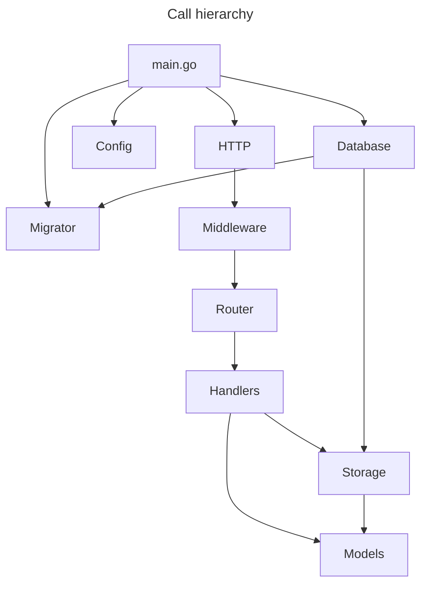

# REST API for Qlik demonstration

Welcome to my repo for the Qlik audition project.

## Introduction

This project will use Docker to create a Golang server and Postgres database to serve up a basic REST API. You will be able to create a User and then save Messages as that user. When viewing Messages, the system will analyze the text and inform you if it is a palindrome (ie. a word that is spelled the same backwards and forwards).

## Installation

 - Set up your local environment with Docker and Git
 - Clone this repository into a project directory
 - Copy the `example.env` file and rename it to `.env`
   - Populate with the values needed (some defaults are provided)
 - Run: `docker compose up`
   - This will create two images: `api` and `postgres`
   - Docker will load up the `postgres` container and perform a health check until it is ready for connections
   - Docker will then load up the `api` container and perform any pending database migrations
   - (**Development:** API is ready to use when AIR has finished loading and you see `running...` in the terminal logs)
 - Query the API:
   - Using VS Code? Try [REST Client](https://marketplace.visualstudio.com/items?itemName=humao.rest-client) extension and use the `tests/api.rest` file to test queries quickly
   - Open a web browser to `http://localhost:8080/api/v1/messages` (changing `8080` to what you set for `API_PORT`)
   - CURL the endpoint in your terminal `curl http://localhost:8080/api/v1/messages` (changing `8080` to what you set for `API_PORT`)

## Architecture

**General system design:**

 - Anyone can create a User account (and be assigned an API key).
 - Anyone can view Messages in the system.
 - Users can only create, update, and delete their own Messages using their API key.

**Notes about current implementation:**

Use of custom code vs. modules:

- Since this test aimed to demonstrate my ability to code, I opted to write simpler custom code.
- Normally I would leverage existing modules for ease of development, security, maintenance, and reliability (ex: routing, middleware, validation, etc.).

Due to time constraints, the following features are **NOT** implemented:
 
 - **User authentication (not implemented):** User authentication should be required to create API keys and restrict user access to the system. Currently anyone can create a new User account and receive an API key.
 - **Robust server logging (not implemented):** Logging and monitoring are important aspects for system health, so a more detailed logging and error handling system should be used.
 - **Automated testing (partially implemented):** Unit and integration tests are important for rapid development. Minimal tests were created to demonstrate capability.
 - **Production-ready build (not implemented):** This development build is outfitted with Air to rebuild during development and regular migration checks at startup. In production we would want features like this disabled/redesigend.
 - **Endpoint caching (not implemented):** Data can be cached to improve server security using tools like Redis, Memcache, etc.



## Package structure

```
.
├── api/
|    ├── entity/
|    |    ├── message/
|    |    └── user/
|    └── router/
|         └── middleware/
├── cmd/
|    └── api/
|         └── main.go
├── config/
├── internal/
|    ├── apikey/
|    ├── context/
|    ├── migrator/
|    ├── util/
|    |    └── baddata
|    └── validation/
├── migrations/
└── tests/
```

------

# REST API Endpoints

## Get list of Users

### Request

`GET /api/v1/users`

    curl -i -H 'Accept: application/json' http://localhost:8080/api/v1/users

### Response

    HTTP/1.1 200 OK
    Content-Type: application/json
    Date: Wed, 05 Jun 2024 06:00:57 GMT
    Content-Length: 774
    Connection: close

    [
      {
        "user_id": "d2558d85-6ebd-492e-85c6-64687dcb04f2",
        "api_key": "",
        "last_access": "2024-06-05T04:25:48.731814Z",
        "name": "Bob Ross"
      }
    ]

## Create a User

### Request

`POST /api/v1/users`

    curl -i -H 'Accept: application/json' -d 'full_name=Bob&email=bob@gmail.com' http://localhost:8080/api/v1/users

### Response

    HTTP/1.1 201 Created
    Content-Type: application/json
    Date: Wed, 05 Jun 2024 06:01:53 GMT
    Content-Length: 167
    Connection: close

    [
      {
        "user_id": "238208a8-2bc2-4ddd-965c-2eee7c47a23a",
        "api_key": "6b3877b4-50ab-461b-8f4f-0904521becbe",
        "last_access": "2024-06-05T06:01:53.107558Z",
        "name": "Bob"
      }
    ]

## Get list of Messages

### Request

`GET /api/v1/messages`

    curl -i -H 'Accept: application/json' http://localhost:8080/api/v1/messages

### Response

    HTTP/1.1 200 OK
    Content-Type: application/json
    Date: Wed, 05 Jun 2024 06:03:23 GMT
    Content-Length: 501
    Connection: close

    [
      {
        "user_id": "fd06d3e1-c405-4ff3-945c-34b98ef49e8c",
        "create_date": "2024-06-05T05:24:46.787718Z",
        "message": "notpalindrome",
        "is_palindrome": false,
        "last_updated_date": "2024-06-05T05:24:46.787718Z",
        "last_updated_by": "fd06d3e1-c405-4ff3-945c-34b98ef49e8c"
      }
    ]

## Get list of User's Messages

### Request

`GET /api/v1/messages/{userId}`

    curl -i -H 'Accept: application/json' http://localhost:8080/api/v1/messages/fd06d3e1-c405-4ff3-945c-34b98ef49e8c

### Response

    HTTP/1.1 200 OK
    Content-Type: application/json
    Date: Wed, 05 Jun 2024 06:04:54 GMT
    Content-Length: 501
    Connection: close

    [
      {
        "user_id": "fd06d3e1-c405-4ff3-945c-34b98ef49e8c",
        "create_date": "2024-06-05T05:24:46.787718Z",
        "message": "notpalindrome",
        "is_palindrome": false,
        "last_updated_date": "2024-06-05T05:24:46.787718Z",
        "last_updated_by": "fd06d3e1-c405-4ff3-945c-34b98ef49e8c"
      }
    ]

## Get a Message

### Request

`GET /api/v1/messages/{userId}/{createDate}`

    curl -i -H 'Accept: application/json' http://localhost:8080/api/v1/messages/fd06d3e1-c405-4ff3-945c-34b98ef49e8c/2024-06-05T05:24:46.787718Z

### Response

    HTTP/1.1 200 OK
    Content-Type: application/json
    Date: Wed, 05 Jun 2024 06:06:32 GMT
    Content-Length: 251
    Connection: close

    [
      {
        "user_id": "fd06d3e1-c405-4ff3-945c-34b98ef49e8c",
        "create_date": "2024-06-05T05:24:46.787718Z",
        "message": "notpalindrome",
        "is_palindrome": false,
        "last_updated_date": "2024-06-05T05:24:46.787718Z",
        "last_updated_by": "fd06d3e1-c405-4ff3-945c-34b98ef49e8c"
      }
    ]

## Create a Message

### Request

`POST /api/v1/messages`

    curl -i -H 'Accept: application/json' -d 'message=radar&api_key=6b3877b4-50ab-461b-8f4f-0904521becbe' http://localhost:8080/api/v1/messages

### Response

    HTTP/1.1 201 Created
    Content-Type: application/json
    Date: Wed, 05 Jun 2024 06:08:16 GMT
    Content-Length: 242
    Connection: close

    [
      {
        "user_id": "fd06d3e1-c405-4ff3-945c-34b98ef49e8c",
        "create_date": "2024-06-05T06:08:16.349294Z",
        "message": "radar",
        "is_palindrome": true,
        "last_updated_date": "2024-06-05T06:08:16.349294Z",
        "last_updated_by": "fd06d3e1-c405-4ff3-945c-34b98ef49e8c"
      }
    ]

## Update a Message

### Request

`PUT /api/v1/messages/{userId}/{createDate}`

    curl -i -H 'Accept: application/json' -X PUT -d 'message=radar&api_key=6b3877b4-50ab-461b-8f4f-0904521becbe&last_updated=2024-06-05T06:08:16.349294Z' http://localhost:8080/api/v1/messages/fd06d3e1-c405-4ff3-945c-34b98ef49e8c/2024-06-05T06:08:16.349294Z

### Response

    HTTP/1.1 200 OK
    Content-Type: application/json
    Date: Wed, 05 Jun 2024 06:10:01 GMT
    Content-Length: 243
    Connection: close

    [
      {
        "user_id": "fd06d3e1-c405-4ff3-945c-34b98ef49e8c",
        "create_date": "2024-06-05T06:08:16.349294Z",
        "message": "sword",
        "is_palindrome": false,
        "last_updated_date": "2024-06-05T06:10:01.726417Z",
        "last_updated_by": "fd06d3e1-c405-4ff3-945c-34b98ef49e8c"
      }
    ]

## Delete a Message

### Request

`DELETE /api/v1/messages/{userId}/{createDate}`

    curl -i -H 'Accept: application/json' -X DELETE -d 'api_key=6b3877b4-50ab-461b-8f4f-0904521becbe&last_updated=2024-06-05T06:10:01.726417Z' http://localhost:8080/api/v1/messages/fd06d3e1-c405-4ff3-945c-34b98ef49e8c/2024-06-05T06:08:16.349294Z

### Response

    HTTP/1.1 200 OK
    Content-Type: application/json
    Date: Wed, 05 Jun 2024 06:11:50 GMT
    Content-Length: 243
    Connection: close

    [
      {
        "user_id": "fd06d3e1-c405-4ff3-945c-34b98ef49e8c",
        "create_date": "2024-06-05T06:08:16.349294Z",
        "message": "sword",
        "is_palindrome": false,
        "last_updated_date": "2024-06-05T06:11:50.872782Z",
        "last_updated_by": "fd06d3e1-c405-4ff3-945c-34b98ef49e8c"
      }
    ]
