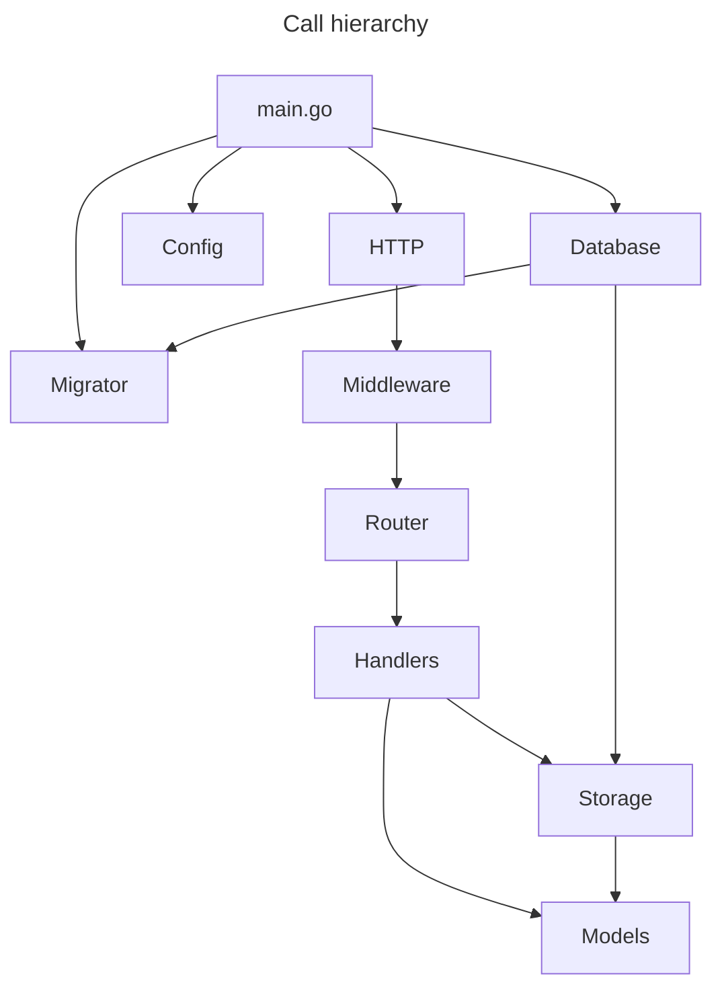

# REST API for Qlik demonstration

Welcome to my repo for the Qlik audition project.

## Introduction

This project will use Docker to create a Golang server and Postgres database to serve up a basic REST API. You will be able to create a User and then save Messages as that user. When viewing Messages, the system will analyze the text and inform you if it is a palindrome (ie. a word that is spelled the same backwards and forwards).

## Installation

 - Set up your local environment with Docker and Git
 - Clone this repository into a project directory
 - Copy the `example.env` file and rename it to `.env`
   - Populate with the values needed (some defaults are provided)
 - Run: `docker compose up`
   - This will create two images: `api` and `postgres`
   - Docker will load up the `postgres` container and perform a health check until it is ready for connections
   - Docker will then load up the `api` container and perform any pending database migrations
   - (**Development:** API is ready to use when AIR has finished loading and you see `running...` in the terminal logs)
 - Query the API:
   - Using VS Code? Try [REST Client](https://marketplace.visualstudio.com/items?itemName=humao.rest-client) extension and use the `tests/api.rest` file to test queries quickly
   - Open a web browser to `http://localhost:8080/api/v1/messages` (changing `8080` to what you set for `API_PORT`)
   - CURL the endpoint in your terminal `curl http://localhost:8080/api/v1/messages` (changing `8080` to what you set for `API_PORT`)

## Architecture

**General system design:**

 - Anyone can create a User account (and be assigned an API key).
 - Users can view all Messages in the system using their API key.
 - Users can only create, update, and delete their own Messages using their API key.

**Notes about current implementation:**

Use of custom code vs. modules:

- Since this test aimed to demonstrate my ability to code, I opted to write simpler custom code.
- Normally I would leverage existing modules for ease of development, security, maintenance, and reliability (ex: routing, middleware, validation, etc.).

Due to time constraints, the following features are **NOT** implemented:
 
 - **User authentication validation (not implemented):** The original goal was to use an API key implementation to restrict user access to the system.
 - **Robust server logging (not implemented):** Logging and monitoring are important aspects for system health, so a more detailed logging and error handling system should be used.
 - **Automated testing (partially implemented):** Unit and integration tests are important for rapid development. Minimal tests were created to demonstrate capability.
 - **Production-ready build (not implemented):** This development build is outfitted with Air to rebuild during development and regular migration checks at startup. In production we would want features like this disabled/redesigend.
 - **Endpoint caching (not implemented):** Data can be cached to improve server security using tools like Redis, Memcache, etc.



## Package structure

```
.
├── api/
|    ├── entity/
|    |    ├── message/
|    |    └── user/
|    └── router/
|         └── middleware/
├── cmd/
|    └── api/
|         └── main.go
├── config/
├── internal/
|    ├── context/
|    ├── migrator/
|    ├── util/
|    |    └── baddata
|    └── validation/
├── migrations/
└── tests/
```

------

# REST API Endpoints

## Get list of Users

### Request

`GET /api/v1/users`

    curl -i -H 'Accept: application/json' http://localhost:8080/api/v1/users

### Response

    HTTP/1.1 200 OK
    Date: Wed, 05 Jun 2024 00:18:56 GMT
    Content-Length: 449
    Content-Type: text/plain; charset=utf-8
    Connection: close

    [
      {
        "user_id": "ffc44559-044d-4525-ae8a-4bd37f2a3d7a",
        "last_access": "2024-06-04T23:28:19.580853Z",
        "name": "Bob Ross"
      },
      {
        "user_id": "0d8577b9-c71b-4cad-8375-227234e58cd4",
        "last_access": "2024-06-04T23:28:19.580853Z",
        "name": "Mr Rogers"
      }
    ]

## Get list of Messages

### Request

`GET /api/v1/messages`

    curl -i -H 'Accept: application/json' http://localhost:8080/api/v1/messages

### Response

    HTTP/1.1 200 OK
    Date: Wed, 05 Jun 2024 00:25:53 GMT
    Content-Length: 252
    Content-Type: text/plain; charset=utf-8
    Connection: close

    []

## Get list of User's Messages

### Request

`GET /api/v1/messages/{userId}`

    curl -i -H 'Accept: application/json' http://localhost:8080/api/v1/messages/ffc44559-044d-4525-ae8a-4bd37f2a3d7a

### Response

    HTTP/1.1 200 OK
    Date: Wed, 05 Jun 2024 00:25:53 GMT
    Content-Length: 252
    Content-Type: text/plain; charset=utf-8
    Connection: close

    []

## Get a Message

### Request

`GET /api/v1/messages/{userId}/{createDate}`

    curl -i -H 'Accept: application/json' http://localhost:8080/api/v1/messages/ffc44559-044d-4525-ae8a-4bd37f2a3d7a/2024-06-04T23:28:19.580853Z

### Response

    HTTP/1.1 200 OK
    Date: Wed, 05 Jun 2024 00:25:53 GMT
    Content-Length: 252
    Content-Type: text/plain; charset=utf-8
    Connection: close

    []

## Create a Message

### Request

`POST /api/v1/messages`

    curl -i -H 'Accept: application/json' -d 'message=notpalindrome&api_key=ba7816bf8f01cfea414140de5dae2223b00361a396177a9cb410ff61f20015ad' http://localhost:8080/api/v1/messages

### Response

    HTTP/1.1 201 CREATE
    Date: Wed, 05 Jun 2024 00:25:53 GMT
    Content-Length: 252
    Content-Type: text/plain; charset=utf-8
    Connection: close

    []

## Update a Message

### Request

`PUT /api/v1/messages/{userId}/{createDate}`

    curl -i -H 'Accept: application/json' -X PUT -d 'message=newmessage&last_updated=2024-06-05T00:25:49.621704Z&api_key=ba7816bf8f01cfea414140de5dae2223b00361a396177a9cb410ff61f20015ad' http://localhost:8080/api/v1/messages/ffc44559-044d-4525-ae8a-4bd37f2a3d7a/2024-06-04T23:28:19.580853Z

### Response

    HTTP/1.1 201 PUT
    Date: Wed, 05 Jun 2024 00:25:53 GMT
    Content-Length: 252
    Content-Type: text/plain; charset=utf-8
    Connection: close

    []

## Delete a Message

### Request

`DELETE /api/v1/messages/{userId}/{createDate}`

    curl -i -H 'Accept: application/json' -X DELETE -d 'last_updated=2024-06-05T00:25:49.621704Z&api_key=ba7816bf8f01cfea414140de5dae2223b00361a396177a9cb410ff61f20015ad' http://localhost:8080/api/v1/messages/ffc44559-044d-4525-ae8a-4bd37f2a3d7a/2024-06-04T23:28:19.580853Z

### Response

    HTTP/1.1 201 DELETE
    Date: Wed, 05 Jun 2024 00:25:53 GMT
    Content-Length: 252
    Content-Type: text/plain; charset=utf-8
    Connection: close

    []
